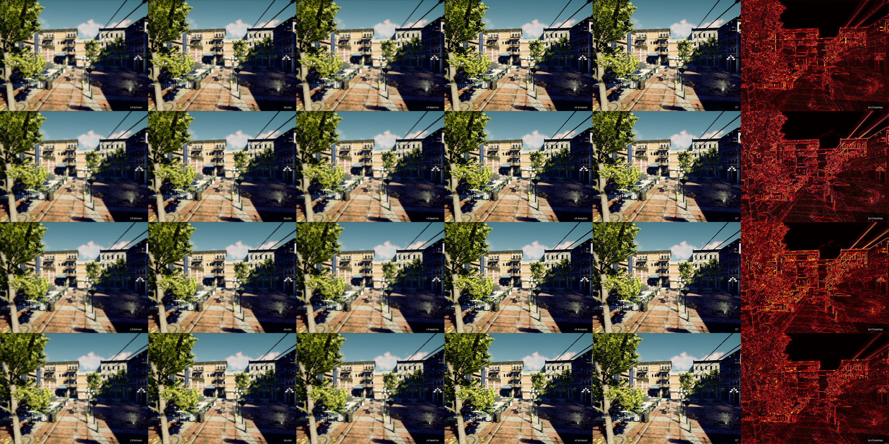

# OpenSuperSampling (OSS)

[](https://github.com/cashcon57/open-supersampling/actions/workflows/ci.yml)
[](LICENSE)
[](#status-at-a-glance)

> **TL;DR for reviewers.** Vendor-neutral, Apache-2.0 game **super-resolution + frame extrapolation built on one architecture**: a persistent 2D Gaussian canvas warped frame-to-frame by exact engine motion vectors, with covariance resampling (GS-STVSR) at the rasterizer. The same canvas, rendered at α=1, is the upscaled current frame; rendered at α∈(0,1) along the motion field, it is an extrapolated future frame **at near-zero marginal cost** — no separate frame-generation network. DLSS, FSR, and XeSS each ship two networks (SR + FG) trained and tuned separately; OSS targets the same surface area with one. The covariance step is anti-aliased *by construction*, which is something pixel-grid SR fundamentally cannot match.
>
> **Goal of the project, in three lines:** better SR quality at the same compute, better frame extrapolation at lower compute (because it reuses the SR canvas), and better generalization across game engines (because the canvas is engine-agnostic — it accumulates whatever the renderer feeds it, rasterized or ray-traced).
>
> **Status.** v5-pixel-temporal (the in-distribution validation step before v6) measures **PSNR 25.703 / LPIPS 0.1666 / temporal ratio 0.337×** on TartanAir `oldtown` held-out (single dataset; no cross-dataset eval yet). v6 — the canvas + covariance + cross-attention + spawner architecture — is in training; v6.1 (active) adds randomized spawner offsets and feathered overlapping rasterizer tiles to eliminate a structural 16-pixel grid artifact diagnosed at v6-Pico-001 step-20K. OSS-FX (the α<1 extrapolation path) is one rasterizer call away from the v6 forward, since the canvas + motion field it depends on are already wired; integration is the next sprint. Cross-vendor kernels (CUDA/HIP/Metal/Level Zero/Vulkan) and the DLL-shim integration path are designed but not built. Solo maintainer, AI-augmented development. Looking for compute, hardware loaners, contract or full-time engineering work to take v6 from "in training" to "shipped on real games." See [What I'm asking for](#what-im-asking-for) below.
>
> **⚠ Research model — not the end-user inference model.** Every run on the live dashboard (v5, v6.1, v6.2-pico-002, …) is a **research / teacher** model. The HAT-Tiny backbone these models are built on is far too expensive for real-time game upscaling: measured FP16 eager forward on RTX 3080 Ti (idle) is **54.5 ms at 270×480 LR** and **1,890 ms at 1920×1080 LR**, versus a **<2 ms** DLSS-/FSR-class budget. The end-user shipping model is a **≤1M-param student distilled from these teachers**, exported to TensorRT FP8 with custom cross-vendor kernels — that student is not yet trained and does not appear on the dashboard. See [H006](docs/research/hypotheses/H006-hat-tiny-actual-ms.md), the [Phase 4 council 1–4 ms budget reassessment](docs/research/2026-05-08-phase4-msframe-council/03-1-4ms-budget-reassessment.md), and the [v6.2 spec](docs/architecture/2026-05-08-v62-arch-v4-spec.md) for the kill-HAT-from-inference decision.

**Live training dashboard:** [https://opensupersampling.com](https://opensupersampling.com) — current run, loss curves, viz strips, and historical results, refreshed every ~30 seconds from the training host. Public, no login.

## Why this architecture

DLSS, FSR, XeSS, and every other game upscaler treats super-resolution and frame generation as two separate problems. Two networks. Two latency budgets. Two training pipelines. DLSS Frame Generation is a separate large network bolted on top of DLSS Super Resolution.

OSS treats SR and FG as one problem with one primitive. A persistent 2D Gaussian canvas is accumulated and warped frame-to-frame using exact engine motion vectors, with covariance resampling (GS-STVSR) handling anti-aliasing at the rasterizer. To upscale the current frame: render the canvas at **α=1**. To extrapolate a future frame: render the same canvas at **α∈(0,1)** along the motion field. One rasterizer call either way; no additional network is invoked for the extrapolation case.

Three concrete consequences this is built to deliver:

1. **Frame extrapolation at near-zero marginal cost.** No second network. The compute surface for SR + FG combined is roughly that of DLSS-SR alone, not DLSS-SR + DLSS-FG. The α<1 path is unwired today (next implementation step) but reuses the canvas and motion field that v6 already maintains.
2. **A higher SR quality ceiling than pixel-grid methods.** Pixel-grid SR is bounded by Nyquist of the output grid plus whatever post-hoc filtering you stack on top. Gaussian-canvas SR sets the reconstruction-kernel covariance directly — anti-aliasing happens at the rasterizer (EWA filter in covariance space) rather than as a post-process. Sharper edges and fewer shimmer artifacts on the same input, by construction rather than by training trick.
3. **Cross-engine generalization as a property, not a port.** The canvas is engine-agnostic — it accumulates whatever the renderer produces, regardless of whether the upstream is rasterized, ray-traced, Lumen-lit, or hand-written shader output. Cross-engine generalization (UE5, Unity, Source 2) becomes a v6 *training* objective rather than a per-engine integration problem.

This is the pitch. The rest of the README is the evidence and counter-evidence — what is wired, what is measured, and what is honestly still aspirational.

---

## Versioning convention

OSS uses **three independent naming layers**. They're easy to confuse — especially when reading commits or training logs — so spelling them out:

| Layer | Where it appears | Format | Example | Mutable? |
| --- | --- | --- | --- | --- |
| **Project semver** | `pyproject.toml`, GitHub releases, `pip install`, `CHANGELOG.md` | `0.x.y[.devN]` per [SemVer pre-1.0](https://semver.org/#spec-item-4) | `0.6.0.dev0` (current) | Bumps with each release |
| **Architecture iteration** | research / design docs, this README, `docs/architecture/` | unprefixed `vN[.M]` (research-tradition) | `v6.2 architecture` | Bumps with each architecture rewrite |
| **Training-run identifier** | dashboard rows, checkpoint paths, viz strip filenames | `srcnn-vX.Y-tier-NNN` | `srcnn-v6.2-pico-002` | **Frozen forever** once a run starts |

The three layers move at different rates and are deliberately decoupled:

- A given **architecture iteration** (e.g. `v6.2`) may ship across multiple project releases. The `v6.2` architecture is currently slated for the `0.6.0` release.
- A given **project release** may include changes to multiple architecture iterations (e.g. infrastructure fixes that touch the v6, v6.1, and v6.2 code paths simultaneously).
- A **training run identifier** is permanent — `srcnn-v6.2-pico-002` keeps that name forever, even after `v6.3` lands or the project ships `1.0`. Renaming would break dashboard data continuity and git history.

If a sentence touches more than one layer, name them explicitly: *"the v6.2 architecture work to be packaged in the 0.6.0 release; the first run on v6.2 is `srcnn-v6.2-pico-002`."*

---

## Status at a glance

State vocabulary (used in the column below): **Measured** = code shipped, training run, numbers published. **Training now** = code shipped, model consuming GPU as you read this. **Wired** = code runs end-to-end on synthetic input, no notable training result yet. **In implementation** = code being written, not runnable end-to-end. **Designed only** = memo + spec exist, zero code. **Parked / Superseded** = explicitly stopped or replaced by a successor.

| Component | State | Evidence |
| --- | --- | --- |
| v4 single-frame upscaler | **Measured** | ~30.1 dB PSNR / 0.30 LPIPS on the SRGD held-out batch (single dataset); 720p→1440p 15.6 ms, 1080p→4K 37.6 ms on RTX 3080 Ti TRT FP16. Distribution-shifts hard onto TartanAir (11.7 dB) — that gap is what v5/v6 are built to close. |
| v5-pixel-temporal | **Measured (in-distribution only)** | PSNR 25.703 dB / LPIPS 0.1666 / temporal-stability ratio 0.337× on TartanAir `oldtown` held-out (64 frames, 2× SR). Beats bicubic on 64/64 frames. Trained on TartanAir Easy with `oldtown` excluded — no cross-dataset eval. [eval memo](docs/superpowers/experiments/2026-05-06-v5-pixel-temporal-final-held-out-eval.md) |
| v5-Gaussian-temporal | **Parked** | Scaffolded but never converged. Superseded by the v6 architecture jump (2026-05-06). |
| v6 architecture (baseline) | **Superseded by v6.1** | Forward + trajectory training loop wired (253 v6 tests pass). v6-Pico-001 trained to step-20K then stopped after a structural 16-pixel grid artifact was diagnosed across HAT window-attention + rasterizer tile + spawner tile (2026-05-07). The code path remains in tree behind config flags. |
| **v6.1 architecture (research / teacher)** | **Stopped 2026-05-08, superseded by v6.2** | Pico tier with randomized per-frame spawner tile offsets + overlapping rasterizer tiles with cosine feathering. Stopped after the stippling artifact was diagnosed as not fixable mid-flight. **Teacher model, not the end-user inference model.** Background: [v6.1 memo](docs/superpowers/experiments/2026-05-07-v6.1-pico-grid-artifact-architectural-fix.md). |
| **v6.2 architecture (research / teacher, training now)** | **Pico-002 training — `srcnn-v6.2-pico-002`** | The current dashboard run. **Research / teacher model — not the end-user inference model.** v6.2-pico-002 inherits the v6.2 spec (HAT-Tiny backbone, concat-fusion, disocclusion spawner, R=16 latent rasterizer). HAT-Tiny is too expensive for real-time inference (see TL;DR), so this run exists to (a) validate the canvas + spawner + fusion architecture end-to-end and (b) produce the **teacher checkpoint** that a ≤1M-param student will be distilled against in a later run. Spec: [`docs/architecture/2026-05-08-v62-arch-v4-spec.md`](docs/architecture/2026-05-08-v62-arch-v4-spec.md). Skeptical priority stack: [`docs/research/2026-05-08-phase4-priority-stack-v4.md`](docs/research/2026-05-08-phase4-priority-stack-v4.md). Kill-HAT decision: [H006](docs/research/hypotheses/H006-hat-tiny-actual-ms.md). |
| **Distilled student (end-user inference model)** | **Not yet trained** | ≤1M-param student (nano-CNN, 4–8 residual blocks) distilled from the v6.2 HAT-Tiny teacher, exported to TensorRT FP8 with custom cross-vendor kernels. Target budget: <2 ms total backbone + raster + composite at 1080p LR → 1440p/4K HR, on par with DLSS 4 FP8 and FSR 4. This is the model intended to ship to end users; it does not appear on the live dashboard because it does not exist yet. Plan: [Phase 4 council 1–4 ms budget reassessment](docs/research/2026-05-08-phase4-msframe-council/03-1-4ms-budget-reassessment.md). |
| OSS-RR (ray reconstruction) | **Designed — parked behind v6.2 SR+FG ship** | The Gaussian canvas is engine-agnostic: it accumulates whatever the renderer feeds it. Noisy 1-4 SPP ray-traced samples can flow through the same canvas + covariance resampling pipeline, with the canvas providing temporal+spatial denoising via accumulated EWA splatting (same math as SR, different input). Realistic order: v6.2 SR+FG ships first → cross-vendor kernels land → THEN OSS-RR (likely v8+). The structural support is in the architecture from day one; only the input adaptor + denoise-specific loss recipe are missing. |
| v6 held-out eval pipeline | **Wired** | `scripts/sr_v6_held_out.py` mirrors the v5 eval flow on the same TartanAir `oldtown` 64-frame batch and writes apples-to-apples score_log.json rows (2026-05-07). Will populate v6.1 numbers as Pico-001 checkpoints land. |
| OSS-FX frame extrapolation (α<1 path) | **Designed only — but one rasterizer call away** | Reuses the v6 canvas + motion field already wired in the v6 forward path. No new network. Implementation is the sprint immediately after v6.1-Pico converges. |
| Cross-game-engine eval (UE5 / Unity HDRP / Source 2) | **Not started** | Gating step before any cross-engine claim is allowed in this README. Targeted as the v6.1-Standard / v6.1-Heavy training objective once Pico converges and Net2Net expansion lands. |
| OSS Capture Tool | **In implementation** | Ingest, uploader, installer input/WiX generation, tray flow, and degraded D3D12 hook telemetry exist. No compiled/signed MSI and no real game EXR training capture has passed acceptance yet. |
| Per-vendor kernels (CUDA / HIP / Metal / Level Zero / Vulkan) | **Designed only** | CUDA path uses gsplat today. Native HIP, Metal, Level Zero, and Vulkan compute are zero lines of code. 6–12 months of engineering across the four backends. |
| DLL-shim runtime | **Designed only** | Sprint 7. A per-title DLL hooks the engine's DLSS / FSR / XeSS input slots and routes LR + G-buffers through OSS instead. |

Open-source super-resolution **and** frame extrapolation for games, sharing one Gaussian-canvas architecture (rendered at α=1 for SR, α∈(0,1) for FG — same canvas, same motion field, no second network). Designed cross-vendor (NVIDIA today; AMD, Apple, Intel, Steam Deck targeted via per-vendor kernels in v6 — none of those backends are yet implemented or measured). No SDK contract, no vendor lock-in. The planned integration path is a DLL shim for titles already exposing DLSS, FSR, or XeSS inputs (designed, not yet built).

Pre-alpha. Active research. Apache 2.0 licensed — use it freely in commercial games.

Maintained by Cash Conway (<cashcon57@gmail.com>), solo maintainer with AI-augmented development. Available for studios and GPU vendors interested in vendor-neutral SR work — consulting, integration help, training-recipe tuning, or full-time engineering.

---

## Teacher / student split — what we train vs what ships

OSS uses the same teacher / student distillation pattern DLSS, FSR, and XeSS all use:

- **Research / teacher models** carry the architectural innovations and target highest possible quality. They are too expensive to ship to end users. Every run on the [live dashboard](https://opensupersampling.com) is a *teacher*.
- **End-user inference models (students)** are smaller, distilled from the teachers, and TensorRT/HIP/Metal/Level Zero/Vulkan-compiled with custom cross-vendor kernels. They are what actually runs in a player's game at sub-2ms per frame.

The pipeline is *teacher first, student second*. Building the teacher is what the live dashboard is showing; student distillation is the step that turns it into something shippable on a real GPU at real-time framerates.

### Hardware tiers — what ships to whom

Three tiers share one architecture, scaled. Each tier has its own teacher / student pair. The teacher is a transformer-class backbone (HAT) — matching DLSS 4's transformer direction. The shipping student is a small CNN, distilled from the teacher.

| Tier | Teacher (research, ON THE DASHBOARD) | Shipping student (NOT YET TRAINED) | Target hardware | Ship latency budget |
| --- | --- | --- | --- | --- |
| **Pico** | HAT-Tiny (~3M params, transformer) | ≤0.4M-param nano-CNN, TensorRT FP8 | Steam Deck, integrated GPUs, mobile dGPU | <2 ms at 720p → 1080p |
| **Standard** | HAT-Small (~5M params, transformer) | ≤1M CNN, TensorRT FP8 | RTX 30+, RX 6700+, Arc, M2+ | <3 ms at 1080p → 1440p |
| **Heavy** | OSS HAT-L-derived Heavy (~17M params, transformer) | ≤2M CNN, TensorRT FP8 | RTX 4080+, RX 7900+, M4 Max | <4 ms at 1440p → 4K |

What this looks like on the live dashboard right now:

- `srcnn-v6.2-pico-002` (currently training): Pico-tier **teacher** (HAT-Tiny). Step ~74K of 100K, ~1.5 days remaining.
- `srcnn-v6.1-pico-001` (stopped 2026-05-08): earlier Pico-tier teacher attempt; stopped due to architecture issue.
- Standard / Heavy tier teachers: not yet trained.
- Any tier's shipping student: not yet trained.

The end-user inference model — the thing that lands in a player's game at sub-2ms per frame — is the **student**, and it does not currently exist. Reaching it requires:

1. Finishing the v6.2 architecture cycle (canvas + spawner + cross-attention validated at pico-tier),
2. Training the Heavy teacher at full ~17M-param scale,
3. Distilling each tier's student from its respective teacher,
4. TensorRT / HIP / Metal / Level Zero / Vulkan kernel work for cross-vendor inference.

Full cost estimate for the multi-cycle path to frontier quality: [`docs/coordination/2026-05-11-heavy-cloud-training-cost-estimate.md`](docs/coordination/2026-05-11-heavy-cloud-training-cost-estimate.md).

---

## Latest results (v5-pixel-temporal, 2026-05-06)

**PSNR 25.703 dB · LPIPS 0.1666 · temporal-stability ratio 0.337×** on the TartanAir `oldtown` held-out batch (64 frames, 2× super-resolution from engine LR + G-buffers). Training set: TartanAir Easy with `oldtown` excluded — the model has not been trained or evaluated on any other dataset, and these numbers are in-distribution.

| | PSNR ↑ | LPIPS-VGG ↓ | Temporal ratio ↓ |
|---|---|---|---|
| bicubic baseline | 23.909 | 0.2945 | n/a |
| **OSS v5-pixel-temporal** | **25.703** | **0.1666** | **0.337** |
| v4 single-frame (distribution-shifted on TartanAir) | 11.718 | 0.6367 | reference (1.000) |

v5-pixel-temporal **beat bicubic on 64/64 held-out frames** (100% — spec target ≥95%) and improved temporal stability over v4 by ~3× (spec target ≥2×). Every quality gate of the validation memo passed. Full eval, methodology, and reproduction commands: [`docs/superpowers/experiments/2026-05-06-v5-pixel-temporal-final-held-out-eval.md`](docs/superpowers/experiments/2026-05-06-v5-pixel-temporal-final-held-out-eval.md).

These are the first measured OSS results that establish the temporal-SR architecture works end-to-end on photoreal synthetic flight-sim input (TartanAir). The architecture has not yet been evaluated on actual game-engine footage (UE5, Unity, Source 2); cross-distribution generalization is the explicit v6 training objective. v6 is the production-target architecture currently in training (see below).

(v4's 11.718 dB on TartanAir is the SRGD-trained-model-on-TartanAir distribution-shift failure mode. v4 measured ~30.1 dB / 0.30 LPIPS on its native SRGD held-out batch.)

---

## Quick start

```bash
# clone
git clone https://github.com/cashcon57/open-supersampling.git
cd open-supersampling

# python 3.11+, CUDA 12.x for GPU (CPU works for tests)
python3.12 -m venv venv-py312
source venv-py312/bin/activate
pip install -e .

# verify the code path works (253 v6 tests)
pytest tests/sr/v6/ -q
```

To reproduce the v5 held-out numbers you need the 80K-step checkpoint and the frozen TartanAir `oldtown` manifest. Both are documented in [the eval memo](docs/superpowers/experiments/2026-05-06-v5-pixel-temporal-final-held-out-eval.md) (training script `scripts/sr_train_temporal.py`, eval script `scripts/sr_temporal_held_out.py`). Checkpoints aren't committed; the eval memo records the exact commands, hashes, and result JSON byte-for-byte.

For a faster smoke test on your own machine: `python scripts/sr_train_v6.py --smoke` runs the v6 forward+backward path end-to-end on synthetic data in under a minute.

---

## Where things stand



The image above is the in-flight viz strip from a partial training run. Six panels in reading order: LR-bilinear, bicubic, v5-pixel-temporal, GT, and |error|. It is a mid-training snapshot, not a final measurement and not a vendor comparison. See [docs/results/](docs/results/README.md) for layout and how to regenerate it from a checkpoint.

The v4 single-frame upscaler is trained and exported. On the SRGD held-out batch it sits around 30 dB PSNR / 0.30 LPIPS, against bicubic at 27 dB / 0.45. That is the working baseline.

v5-pixel-temporal completed the validation pass on 2026-05-06. On the TartanAir `oldtown` held-out batch it measures PSNR 25.703 / LPIPS 0.1666 with temporal ratio 0.337 versus v4. See [2026-05-06-v5-pixel-temporal-final-held-out-eval](docs/superpowers/experiments/2026-05-06-v5-pixel-temporal-final-held-out-eval.md). v5-Gaussian-temporal is no longer the main baseline path; Option A was taken on 2026-05-06.

v6 is the architecture intended to ship. As of commit `732166a`, the model + trainer together run the canonical Stage 2 path end-to-end:

- `V6Model.forward()` (`fd8965f`): HAT backbone → motion-vector + GS-STVSR covariance canvas warp → keyframe active mask → cross-attention pixel↔Gaussian fusion → V6Rasterizer renders the active canvas subset to HR → composite head emits 3-channel RGB → softplus / sigmoid → spawner writes fresh Gaussians from refined features back into the persistent per-rank canvas → ST score state updates.
- `scripts/sr_train_v6.py` (`732166a`): per-step samples a trajectory of T consecutive frames (default 4); resets canvas at the trajectory start, threads engine motion vectors between frames, accumulates per-frame loss, runs backward once. The canonical-memo §5 motion-aware temporal-consistency term `||warp(pred_t, motion_t→t+1) − pred_{t+1}||₁` (weight 0.5) keeps adjacent predictions in the graph. `--first-ckpt-step` writes the first non-smoke checkpoint at step 100 by default, so issues surface within minutes of training start.

253 v6 tests pass (`./venv-py312/bin/python -m pytest tests/sr/v6/ -q`). OSS-FX (α<1 canvas rendering) is the next thing on top of the wired forward. The full diagram below is the target architecture; the wired forward path matches it modulo the OSS-FX α path.

The target design uses a persistent 2D Gaussian canvas, warped by exact engine motion vectors with covariance resampling at the rasterizer, fused with a HAT spatial backbone via cross-attention, with score-based active pruning to keep per-frame cost bounded. Three tiers share one architecture: Pico for handhelds, Standard for mainstream desktop, Heavy for enthusiast. Custom kernels per GPU vendor (CUDA, HIP, Metal, Level Zero, Vulkan compute) are the planned path to vendor-stack-competitive latency; none are implemented yet. Frame extrapolation (OSS-FX) is designed as the same canvas rendered at fractional time positions instead of α=1, which would not require a separate ML network the way DLSS Frame Generation does. The α path is not yet wired; it is the next implementation step on top of the current forward.

The canonical v6 design lives in [experiments/2026-05-05-v6-architecture-canonical.md](docs/superpowers/experiments/2026-05-05-v6-architecture-canonical.md). The implementation roadmap, derived from deep-reads of GSASR, AAA-Gaussians, AA-2DGS, vk_gaussian_splatting, and GaussianVideo, is in [research/2026-05-05-v6-external-baselines-integration-plan.md](docs/research/2026-05-05-v6-external-baselines-integration-plan.md).

Target architecture:

```text
                                    ┌─────────────────────────┐
  current LR + G-buffers ──────────►│ HAT spatial backbone    │──► coarse SR features
  (RGB, depth, motion, normals)     └─────────────────────────┘                │
                                                                               ▼
                                                      ┌────────────────────────────┐
   persistent Gaussian canvas ──► analytical warp ───►│ cross-attention            │──► refined HR features
   (5K-15K Gaussians, accumulated   by engine MVs +   │ (pixel queries × Gaussian  │
    across frames)                  covariance        │  keys/values)              │
                                    resampling        └────────────────────────────┘
                                                                               │
   key-frame active mask (every K=10 frames) ─────────────► rasterizer ─────► HR output
                                                                               │
   Spatial-Temporal Variation Score pruning ◄─── update canvas ◄───────────────┘

   For frame extrapolation: rasterize canvas at α ∈ (0, 1) instead of α = 1.
   Cost: one in-place add to the position tensor.
```

---

## What is measured, what is not

v4 inference latency on RTX 3080 Ti, TensorRT FP16, narrow optimization profiles:

| Input → Output | Latency |
|---|---|
| 720p → 1440p | 15.6 ms |
| 1080p → 4K | 37.6 ms |

Source: [trt-int8-quantization](docs/superpowers/experiments/2026-05-03-trt-int8-quantization.md).

Steam Deck latency is unmeasured. Real Deck workloads upscale from 540p, 360p, or 240p up to Deck's native 800p (1280×800). Nothing in this table corresponds to a Deck workload, and v4 has not been benchmarked on Deck hardware. The Pico tier and hand-tuned Vulkan compute kernels (both v6) are prerequisites for that measurement.

v4's current latency reflects stock TensorRT FP16 with no per-vendor kernel optimization. Closing the gap to vendor stacks is the entire point of the custom-kernel sprint planned for v6. The table below gives the budgets v6 is targeting parity or competitiveness with.

| System | 1080p → 4K (typical) | 720p → 1440p (typical) | Hardware | Notes |
|---|---|---|---|---|
| FSR 2 / FSR 3 SR (compute shader) | ~0.7–1.0 ms | ~0.4–0.7 ms | RDNA2+, generic GPUs | hand-tuned shaders, no ML |
| DLSS 2 / DLSS 3 SR (CNN) | ~1.5–2.5 ms | ~1.0–1.5 ms | RTX 20+ via NGX | tensor-core-resident MMA |
| DLSS 4 SR (transformer, 2025) | ~3–4 ms | ~2–3 ms | RTX 30+ FP16 | ~4× compute of CNN model |
| DLSS 4 SR (transformer, FP8 path) | ~1.5–2 ms | ~1.0–1.5 ms | RTX 40+ / RTX 50+ FP8 | tensor-core FP8 |
| FSR 4 (ML, 2025) | ~1.5–2 ms | ~1.0–1.5 ms | RDNA4 only | hand-tuned matrix-core kernels |
| XeSS XMX | ~2–3 ms | ~1.5–2 ms | Intel Arc | XMX matrix engines |
| XeSS dp4a fallback | ~5–8 ms | ~3–5 ms | non-Arc, cross-vendor | graceful degradation |

Numbers are approximate published or independently-measured ranges and vary by GPU SKU, scene, and exact resolution. Primary sources: NVIDIA DLSS technical blog, AMD GPUOpen FSR documentation, Intel XeSS whitepaper, Digital Foundry latency-analysis measurements.

v5-pixel-temporal final held-out result: PSNR 25.703 / LPIPS 0.1666 / temporal ratio 0.337 on the TartanAir `oldtown` held-out batch. Source: [2026-05-06-v5-pixel-temporal-final-held-out-eval](docs/superpowers/experiments/2026-05-06-v5-pixel-temporal-final-held-out-eval.md). v5-Gaussian-temporal is implemented but no longer the main baseline after Option A on 2026-05-06.

---

## Known limits

HDR support is partial. The output activation has been changed from sigmoid to softplus, so HDR linear-light values above 1.0 flow through architecturally without clipping. The training corpus (TartanAir, Hypersim, SRGD) is 8-bit sRGB, so HDR-specific patterns like sun discs, neon, specular highlights, and BT.2020 wide gamut are under-represented. Quality on HDR-specific content has not been measured and is expected to be lower than on SDR until a v6.1 retrain on HDR-encoded data.

No game integration has shipped. The DXGI hook and NGX shim that let OSS substitute for DLSS, FSR, or XeSS at runtime are designed but not built. That work is Sprint 7. Inference engines run in isolation; the runtime plumbing is missing.

ML inference at this quality is fundamentally heavier than FSR's hand-tuned shader passes. The plan to bridge the gap is per-vendor custom kernels (v6) plus distillation to a small Pico variant for handhelds and integrated GPUs.

The supported-games list is editorial. Anti-cheat titles using kernel-level systems (Vanguard, BattlEye, EAC, Ricochet) are off the list permanently because DLL injection trips them and risks player bans.

---

## Roadmap

S5 is closed for the baseline decision: v5-pixel-temporal produced the carried-forward result on 2026-05-06, and v5-Gaussian-temporal is parked unless staged smoke tests justify reopening it.

S6 is v6: the covariance-resampled Gaussian-temporal architecture summarized above. Modules, orchestrator, Stage 2 wire-up of `V6Model.forward()` putting canvas in the HR critical path (commit `fd8965f`), and the trajectory training loop with canvas continuity + motion-aware temporal-consistency loss + early checkpoint at step 100 (commit `732166a`) have landed. 253 v6 tests passing. OSS-FX integration is next on the roadmap. Three tiers (Pico, Standard, Heavy), custom per-vendor kernels, and DLL-shim integration remain target work.

S7 is the planned DLL-shim runtime that lets OSS replace DLSS, FSR, or XeSS in already-shipping games without developer cooperation. No game integration has shipped yet. Game requirements: must already use one of the three (which is how OSS receives depth, motion vectors, and jitter), and must not use kernel-level anti-cheat. Candidate validation targets include Cyberpunk 2077, Alan Wake 2, Hogwarts Legacy, Starfield, Baldur's Gate 3, Returnal, Hellblade II, Forza Horizon 5, and Black Myth: Wukong.

S7-data is the OSS Capture Tool. A small DLL drops into supported games, captures rendered frames and engine G-buffers while you play, then deletes the local copies once the server confirms upload. Four bandwidth tiers: trickle (~100 MB/h), lite (~500 MB/h, the default), regular (~2 GB/h), and INSANE (~20–50 GB/h). The server is FastAPI on Cloudflare R2. Codex is implementing the client side; the server side ships under this repo.

The custom-kernel work runs in parallel to S6 and S7. NVIDIA gets CUDA + CUTLASS, AMD desktop gets HIP + rocWMMA, Apple Silicon gets Metal + ANE, Intel Arc gets Level Zero + XMX, and Steam Deck plus everything without matrix accelerators gets hand-written Vulkan compute. These are 6 to 12 month engineering bets, not week-scale tasks. Per-vendor design notes: [vendor-optimization-audit](docs/superpowers/notes/vendor-optimization-audit.md), [cuda-mega-kernel-design](docs/superpowers/notes/cuda-mega-kernel-design.md).

---

## Capture tool

**Status: designed, not yet shipped.** The bandwidth modes, privacy guarantees, and storage layout below describe the intended design. The client side is in implementation; nothing below has been independently validated.

OSS improves when it trains on real games. The Capture Tool is the planned data-collection path.

Planned user flow: install a per-game DLL, play, and choose either local-only capture or upload-to-R2 capture. In local mode, captures remain on disk for operator inspection/training. In upload mode, accepted captures upload and local copies are deleted after terminal upload handling. You set the bandwidth budget at install time and can pause uploads or uninstall whenever.

User docs: [install runbook](docs/capture/INSTALL.md) and [supported games policy](docs/capture/SUPPORTED_GAMES.md).

What does not get captured: audio, keyboard, mouse, controller input, any other window, your desktop, webcam, microphone, chat, save data, or network traffic. Only the supported game's rendered output and its engine buffers.

| Mode | Bandwidth | Trade-off |
|---|---|---|
| trickle | ~100 MB/h | sparse capture, no long temporal sequences |
| lite (default) | ~500 MB/h | the v5/v6 sweet spot, no albedo or roughness |
| regular | ~2 GB/h | adds material channels, higher network bill |
| INSANE | ~20–50 GB/h | full PBR plus 256-frame supersample ground truth on settled cameras; brief stutters disclosed at install |

Identity is designed as a one-time opaque token: no account, no email, no PII. Frames would be written to R2 under `<game_id>/<YYYY-MM>/<capture_mode>/<session_uuid>/<frame_uuid>.exr`, with public per-mode contribution counts. Trained model weights derived from contributed data are intended to ship under CC-BY-4.0; no weights have been published yet, and no contributor data has been collected.

Cyberpunk 2077 is the initial validation target. Full design: [oss-capture-tool-design](docs/superpowers/specs/2026-05-04-oss-capture-tool-design.md).

---

## Hardware tiers (v6)

**Teacher vs student.** The HAT-Tiny backbone used in the current training runs (v6.1, v6.2-pico-002) is a **teacher model**, not the end-user inference path. Measured FP16 eager forward on RTX 3080 Ti (idle): 54.5 ms at 270×480 LR, 1,890 ms at 1920×1080 LR — orders of magnitude above any real-time game-upscaling budget. The end-user inference model in every tier below is a **distilled ≤1M-param student** (nano-CNN backbone, 4–8 residual blocks, TensorRT FP8) trained against the v6.x HAT-Tiny teacher checkpoints. See [H006](docs/research/hypotheses/H006-hat-tiny-actual-ms.md) and the [Phase 4 council 1–4 ms budget reassessment](docs/research/2026-05-08-phase4-msframe-council/03-1-4ms-budget-reassessment.md) for the kill-HAT-from-inference decision.

Distillation chain: HAT-Tiny / HAT-Small / HAT-L teachers (on this dashboard) → per-tier student (not yet trained, will ship). Latency targets below are **student-model ship goals**, not measurements of the teachers currently in training. They are conditional on the per-vendor native-kernel work landing at vendor-stack optimization quality (CUDA + CUTLASS + tensor-core MMA on NVIDIA, HIP + rocWMMA on AMD desktop, Metal + ANE on Apple Silicon, Level Zero + XMX on Intel Arc, hand-tuned Vulkan compute for Steam Deck and matrix-accelerator-less hardware).

| Tier | Teacher (research, on dashboard) | Student (ships, not yet trained) | Canvas | Target hardware | Ship target (student, conditional) | Backend |
| --- | --- | --- | --- | --- | --- | --- |
| Pico | HAT-Tiny (~3M params, ~54 ms / ~1890 ms FP16 eager at 270×480 / 1920×1080 LR — teacher only) | ≤0.4M-param nano-CNN, TensorRT FP8 | ~1–2K Gaussians | Steam Deck, integrated GPUs, mobile dGPU | <2 ms at 720p → 1080p | hand-tuned Vulkan compute |
| Standard | HAT-Small (~5M params, teacher only) | ≤1M-param CNN, TensorRT FP8 | ~5K Gaussians | RTX 30+, RX 6700+, Arc, M2+ | <3 ms at 1080p → 1440p | CUDA / HIP / Metal / Level Zero |
| Heavy | OSS HAT-L-derived Heavy (~17M params, teacher only) | ≤2M-param CNN, TensorRT FP8 | ~15K Gaussians | RTX 4080+, RX 7900+, M4 Max | <4 ms at 1440p → 4K | same per-vendor path |

The targets bracket vendor latency bands: the target Pico latency band falls within handheld budgets; measurement pending. Standard sits in DLSS 2/3 SR territory, and Heavy lands at DLSS 4 transformer territory. See the budget comparison table earlier in this README for context.

Quality modes (planned, by upscale ratio): Ultra Performance 33%, Performance 50%, Balanced 59%, Quality 67%, Ultra Quality 77%. OSAA is anti-aliasing at native resolution (100%).

---

## Training data

SRGD: 51K high-resolution frames across 17 scenes. Sequential, but the depth, motion, and normal channels were placeholder zeros. Used for v3 and v4 training; no temporal gains were realized at v4 ship because of the missing G-buffers.

TartanAir: roughly 600 GB extracted across 18 environments, with real depth and real optical flow from a photoreal sim engine. Primary v5 temporal training set.

Hypersim: photoreal indoor scenes from Blender, with real depth and normals. Not yet integrated.

Sintel: cinema-quality with real depth and flow. A Sintel held-out manifest is frozen for validation; a Sintel fine-tune was scheduled per runbook but has not yet produced a recorded eval result.

Vimeo-90K: planned for OSS-FX, real-world motion diversity.

NoiseBase: planned for OSS-RG (denoiser track). Download is currently blocked on bandwidth allocation on the remote host.

Public datasets are for now. Custom captures are a necessary pain that I will have to work through, but it gives me exaclty what I need, exactly how I need it, in actual games.

---

## Why this exists

DLSS-class quality is locked to NVIDIA RTX hardware through the proprietary NGX runtime. FSR is cross-vendor and open but bounded above by what hand-tuned shaders without learned components can express. XeSS XMX is Intel-only at peak quality. There is no open, cross-vendor, ML-based real-time SR that matches DLSS on RTX hardware.

OSS is an attempt at that gap. The architecture is also designed to unify frame extrapolation and super-resolution under one path: rasterize the persistent canvas at α=1 for the current frame, at α<1 for an intermediate frame. DLSS solves frame extrapolation with a separate ML network that has its own latency and known artifacts. The Gaussian-canvas approach is intended to do it as one in-place add to the position tensor; OSS-FX is not yet implemented, so this design property is unmeasured.

Cross-vendor, open, and unified with frame extrapolation is the bet — not the current state.

---

## Lab-notebook discipline

Every training run, ablation, and benchmark gets a memo in `docs/superpowers/experiments/YYYY-MM-DD-<slug>.md` before the result is allowed to drive a decision. The cost of writing a paragraph before measuring something is much less than the cost of an unmoored decision later. The discipline is documented in [lab-notebook-discipline](docs/papers/lab-notebook-discipline.md).

---

## What I'm asking for

OSS is at the inflection where v5 has measured in-distribution results, v6 is wired and training, and the next step is **cross-game-engine generalization plus the per-vendor kernel work that closes the latency gap to DLSS / FSR / XeSS**. That is not a one-person job in any reasonable timeframe.

### Concrete cost tiers

Anchored on measured pico-002 step time (4.5 s/step on RTX 3080 Ti, bf16, no torch.compile) extrapolated to Heavy on H100 SXM, May 2026 cloud GPU pricing. Full derivation: [`docs/coordination/2026-05-11-heavy-cloud-training-cost-estimate.md`](docs/coordination/2026-05-11-heavy-cloud-training-cost-estimate.md). H100 is the reference because it has stable multi-cloud pricing; B200 is ~2× faster per chip and ~0.85–0.95× the effective dollar cost when available.

| Scope | What it funds | H100-hours | Spot (~$1.50/hr) | On-demand (~$3/hr) | Wall clock on 8× H100 |
| --- | --- | --- | --- | --- | --- |
| **Single Heavy run** | One Heavy teacher training (300K steps, 1 config). Credibility checkpoint that the architecture converges at Heavy scale. | 1.5K – 3K | **$2.3K – $4.5K** | **$4.5K – $9K** | 5–10 days |
| **Heavy training cycle** | Heavy teacher + 5–10 ablations + hyperparameter sweep + Standard tier distillation + Pico tier (shipping student) distillation + 3–5 cross-engine fine-tunes. One publishable v6.x Heavy result with student tiers ready to ship. | 11K – 22K | **$17K – $33K** | **$34K – $67K** | 5–6 weeks |
| **Path to frontier quality** | Multi-cycle (4 cycles): TartanAir + synthetic UE5, then real game captures via the OSS Capture Tool (Cyberpunk 2077, Alan Wake 2, etc.), then multi-engine + HDR retrain, then quality polish + DLL-shim integration. The number that actually matters: what it takes for an open, Apache-2.0, cross-vendor SR stack to land at frontier real-time-SR quality (≥30 dB PSNR / ≤0.15 LPIPS cross-engine, ≤2 ms inference on RTX 4070-class). | 50K – 150K | **$75K – $225K** | **$150K – $450K** | 18–24 months overall |

Storage: 50–200 TB of cross-engine game captures over 18–24 months on Cloudflare R2 at $15/TB/month = **$13K – $72K cumulative**. Engineering: currently solo, AI-augmented; one fully-loaded senior US AI-lab engineer-year is $300K – $500K if the project funds headcount instead of compute. Inference rig (one RTX 4070-class, one RX 7900-class, one Arc B-series, one M-series Mac, one Snapdragon dev kit): **$5K – $10K one-time** for cross-vendor kernel benchmarking.

For context: the frontier-quality number is roughly the cost of **one senior engineer-year at a US AI lab, fully loaded** — paying for compute instead of headcount, with the deliverable being an open-source upscaler that any studio can ship on any GPU vendor's hardware without a license fee or an NGX-runtime dependency. Sponsoring this work is the leverage point.

### How sponsorship can land

In rough order of preference:

1. **A job, contract, or paid consulting role on vendor-neutral SR.** Available full-time, remote (US-based), comfortable with open-source as the deliverable. Equally interested in research-engineer, applied-research, or kernel-engineer work; cross-vendor SR is the throughline. Salary band $300K – $500K fully loaded; alternatively, contract / consulting day-rates.
2. **Cloud GPU credits** — see the cost table. $2K – $9K funds a single Heavy training run, fits an early-stage corporate dev-rel program or pilot research credit. $17K – $67K funds a complete Heavy cycle, fits an NSF ACCESS / NAIRR allocation, an Oracle for Research credit, an HF community grant, or a Lambda / Modal / NVIDIA Inception strategic allocation. $75K – $450K funds the frontier-quality multi-cycle path and typically requires a strategic vendor partnership (AMD, Intel, Cloudflare, CoreWeave, or NVIDIA having a strategic interest in open vendor-neutral SR) or a corporate engineering investment.
3. **Hardware loaners.** A loaned **MI300X, B200, or H100 8-GPU node for 90 days** is roughly equivalent to **$30K – $70K of cloud spot credit** at sustained 80% utilization, and is what one Heavy training cycle physically runs on. A loaned **Intel Battlemage Arc, Tenstorrent Wormhole / Blackhole, M4 Max Mac Studio, or Snapdragon dev kit** unlocks the cross-vendor kernel sprint that turns "the model trains" into "the model ships on AMD / Intel / Apple / handheld hardware natively." A loaned Steam Deck dev kit unlocks the handheld Pico target.
4. **Studio + game-engine partnerships.** A studio that has shipped DLSS / FSR / XeSS-integrated titles can **co-fund the OSS Capture Tool pipeline against their own title's footage**, in exchange for a vendor-neutral DLL-shim integration tuned for their engine. The marginal cost vs. their existing per-title vendor-stack tuning is small; the payoff is one upscaler that ships on every GPU their players own.
5. **Cash grants.** Lower priority for a solo pre-alpha project, but Apache 2.0 + a measured v5 result + v6 wired-in-code is enough surface area for some compute-flavored grants. AI Grant and Epic MegaGrants likely become realistic only once v6 ships and runs in a real engine.

What you get in return: OSS is **Apache-2.0** licensed; trained model weights are planned for **CC-BY-4.0** when they ship. Cross-vendor SR is the throughline. Any sponsor underwriting this work funds a public-good upscaler that runs everywhere, with no licensing footprint, no proprietary runtime dependency, and no per-title integration fee. That is the bet.

If any of these fits something you can offer, please reach out: <cashcon57@gmail.com>.

---

## Reference docs

v5 (current sprint), specs and runbooks:

- [v5-pixel-temporal design](docs/superpowers/specs/2026-05-04-v5-pixel-temporal-design.md)
- [v5-gaussian-temporal design](docs/superpowers/specs/2026-05-04-v5-gaussian-temporal-design.md)
- [Gaussian temporal canvas design](docs/superpowers/specs/2026-05-01-gaussian-temporal-canvas-design.md)
- [v5 pixel-temporal runbook](docs/superpowers/notes/2026-05-04-v5-pixel-temporal-runbook.md)
- [v5 Sintel fine-tune runbook](docs/superpowers/notes/2026-05-04-v5-pixel-sintel-finetune-runbook.md)
- [v5 Gaussian temporal runbook](docs/superpowers/notes/2026-05-04-v5-gaussian-temporal-runbook.md)
- [v5 pixel temporal ONNX export design](docs/superpowers/notes/2026-05-04-v5-pixel-temporal-onnx-export-design.md)

Point-in-time status snapshots, codex coordination notes, and superseded sprint plans live under [docs/archive/](docs/archive/) for historical reference.

v6 architecture (locked 2026-05-05):

- [v6 canonical design](docs/superpowers/experiments/2026-05-05-v6-architecture-canonical.md)
- [v6 external-baselines integration plan](docs/research/2026-05-05-v6-external-baselines-integration-plan.md)
- [GS research deep-dive (math)](docs/research/2026-05-05-gaussian-temporal-research-deep-dive.md)
- [Existing Gaussian-Splatting repos survey](docs/research/2026-05-05-existing-gaussian-splatting-repos-survey.md)
- [GSASR + upscale3dgs deep-read](docs/research/2026-05-05-gsasr-and-upscale3dgs-deep-read.md)
- [Anti-aliasing stack deep-read](docs/research/2026-05-05-anti-aliasing-stack-deep-read.md)
- [NVIDIA vk + GaussianVideo deep-read](docs/research/2026-05-05-nvidia-vk-and-gaussianvideo-deep-read.md)

S6 prep (performance pass):

- [Vendor optimization audit](docs/superpowers/notes/vendor-optimization-audit.md)
- [CUDA mega-kernel design](docs/superpowers/notes/cuda-mega-kernel-design.md)
- [Pico distillation design](docs/superpowers/notes/2026-05-04-pico-distillation-design.md)

S7 prep (game integration):

- [S7 game integration design](docs/superpowers/notes/2026-05-04-s7-game-integration-design.md)

OSS Capture Tool:

- [Capture tool design](docs/superpowers/specs/2026-05-04-oss-capture-tool-design.md)
- [D3D12 hook design](docs/superpowers/d3d12-hook-design.md)
- [Install runbook](docs/capture/INSTALL.md)
- [Supported games policy](docs/capture/SUPPORTED_GAMES.md)

Top-level project paper drafts and citation:

- [RESEARCH.md](RESEARCH.md), [BIBLIOGRAPHY.md](BIBLIOGRAPHY.md), [CITATION.cff](CITATION.cff)

---

## License

The repository is Apache 2.0. See [LICENSE](LICENSE) for the canonical text and [NOTICE](NOTICE) for third-party components vendored under MIT and BSD-3-Clause. When trained model weights are released, the intended distribution license is CC-BY-4.0; no weights have been published yet.

## What I won't use

- NRD (RTX SDK contract)
- DLSS / FSR / XeSS decompiled binaries or leaked weights
- `tiny-cuda-nn` (CUDA-only by design; defeats the cross-vendor commitment)
- Quixel, Megascans, or CC-BY-NC training assets

## Repository

Active development branch: `main`. Track docs:

- [oss-sr-cnn-track](docs/superpowers/oss-sr-cnn-track.md): single-frame pixel upscaler, current production candidate
- **Ray-Retracing** — OSS's temporal denoising + spatial reconstruction component. We don't cast new rays; we reuse existing samples by reprojecting them via motion vectors — tracing the original camera ray's screen-space path backward through time. Same surface area as DLSS Ray Reconstruction; different algorithm (we use the persistent Gaussian canvas as the temporal accumulator rather than a learned denoiser network).
- [oss-ray-retracing-track](docs/superpowers/oss-ray-retracing-track.md): OSS Ray-Retracing track
- [oss-gaussian-temporal-track](docs/superpowers/oss-gaussian-temporal-track.md): Gaussian temporal canvas, parent track for v5-gaussian-temporal

Recent decision memos: [docs/superpowers/experiments/](docs/superpowers/experiments/).
