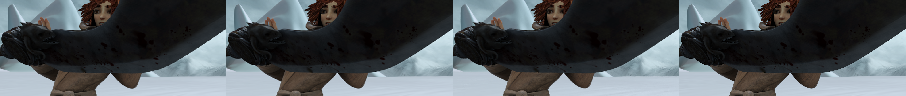
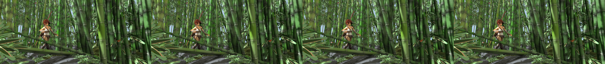
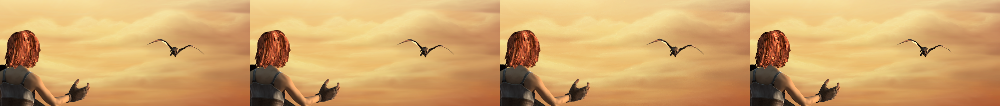

# Naive Image-GS upscaling test (Sprint 4 architectural validation)

**Date**: 2026-05-01
**Machine**: <train-host> (RTX 3080 Ti, gsplat 1.4.0, CUDA 12.4, conda env `image-gs`)
**Script**: [`scripts/test_gaussian_upscaling_naive.py`](../../../scripts/test_gaussian_upscaling_naive.py)
**Raw data**: [`assets/2026-05-01-gaussian-upscaling-naive-test/metrics.csv`](assets/2026-05-01-gaussian-upscaling-naive-test/metrics.csv)

## Hypothesis

The 2D Gaussian splat representation is itself a useful structural prior for
upscaling, separate from any learned detail. If true, even an Image-GS fit to
an LR frame, then rasterised at HR, should approach or beat bicubic.

## Setup

- **Data**: 6 frames from MPI Sintel `training/clean` (1024x436 HR), one per
  scene chosen for content variety: `alley_1` (interior, soft), `ambush_2`
  (bright outdoors), `bamboo_2` (high-frequency foliage), `market_5` (varied
  colour), `temple_3` (architectural edges), `mountain_1` (smooth gradients).
- **LR generation**: 2x box-average downsample (`F.avg_pool2d(k=2,s=2)`) -> 512x218.
- **Image-GS fit**: 50 000 Gaussians, max 5 000 steps, gradient init,
  progressive add-Gaussians on, LR schedule with one decay (defaults from
  `cfgs/default.yaml`). Loss `L1 + 0.1*SSIM`, gamma=1.0.
- **HR render**: same Gaussian set rasterised at 1024x436 via gsplat
  `project_gaussians_2d_scale_rot` + `rasterize_gaussians_sum` with
  `upsample_ratio=2.0` (i.e. `scale *= 2.0`).
- **Baselines**: PyTorch bicubic (`F.interpolate(mode='bicubic')`), PIL
  Lanczos. (Kornia not installed in `image-gs` env; PIL is a faithful
  Lanczos-3.) Both upscale the same 512x218 box-downsampled LR back to 1024x436.
- **Metrics**: PSNR (linear-RGB MSE), SSIM (`skimage`, channel-axis=2),
  LPIPS-VGG (`lpips==0.1.x`).
- **Time budget**: ~2 hours of 3080 Ti GPU. Actual: ~11 minutes wall-clock.
  Per-frame fit: 61-265 s (mean 112 s). Single HR render: ~5-13 ms once
  warmed up.

## Results

### Aggregate (mean +- stdev across 6 frames)

| Method          | PSNR (dB)         | SSIM              | LPIPS-VGG (lower=better) |
|-----------------|-------------------|-------------------|--------------------------|
| Bicubic         | **34.275 +- 3.497** | **0.9563 +- 0.0286** | **0.1204 +- 0.0363**       |
| Lanczos         | **34.418 +- 3.491** | 0.9563 +- 0.0273    | **0.1156 +- 0.0448**       |
| Image-GS naive  | 30.690 +- 3.173    | 0.9170 +- 0.0467    | 0.1694 +- 0.0254          |

### Per-frame (Image-GS naive minus bicubic)

| Scene      | PSNR delta | SSIM delta | LPIPS delta |
|------------|-----------:|-----------:|------------:|
| alley_1    |  -3.40 dB  |  -0.063    |  +0.043     |
| ambush_2   |  -4.09 dB  |  -0.019    |  +0.042     |
| bamboo_2   |  -2.72 dB  |  -0.057    |  +0.010     |
| market_5   |  -3.39 dB  |  -0.034    |  +0.018     |
| temple_3   |  -3.67 dB  |  -0.019    |  +0.134     |
| mountain_1 |  -4.25 dB  |  -0.045    |  +0.047     |
| **mean**   | **-3.59 dB** | **-0.039** | **+0.049**  |

LR-fit PSNR (Image-GS evaluated against the 512x218 LR target it was
optimising) was 42.8 dB on average (range 38.5-47.9). So the fit itself is
fine - the loss happens at HR rasterisation time.

### Visual samples

`ambush_2` (bright outdoor, motion):


`bamboo_2` (high-frequency foliage):


`temple_3` (sharp architectural edges - worst LPIPS gap):


Strip ordering: NN-upscaled LR | bicubic | Image-GS naive | GT. Image-GS
output exhibits "blob" reconstructions on edges where Gaussian footprints
become visible at 2x scale - the Gaussians faithfully reproduce LR pixel
intensities but have no information about sub-pixel HR detail.

## Verdict

**Image-GS naive does not beat bicubic.** Bicubic wins by 2.7-4.3 dB PSNR,
0.02-0.06 SSIM, and 0.01-0.13 LPIPS-VGG on every single frame and every
metric. The result is unanimous and the gap is large.

### Where Image-GS-naive loses (qualitatively)

- **Sharp edges** (temple_3): worst LPIPS gap (+0.134). Gaussians sized to
  reconstruct LR pixels become visible blobs at HR.
- **High-frequency foliage** (bamboo_2): smallest PSNR gap (still -2.72 dB).
  Bicubic also struggles here, so the relative damage is smaller.
- **Smooth gradients** (mountain_1): largest PSNR gap (-4.25 dB). Gaussians
  introduce visible footprint texture in regions where bicubic's smoothness
  is closer to the ground truth.

### Where Image-GS-naive could *only* break even

It does not. There is no frame and no metric where Image-GS-naive
matches the bicubic baseline.

## Implications for Sprint 4

This is the **negative result** from the experiment design. It tells us:

1. **The Gaussian representation does not by itself contain SR detail.** A
   Gaussian fit to LR pixels reproduces LR information at HR resolution -
   nothing more. The Gaussians' continuous footprint provides smoother
   *interpolation* than nearest-neighbour, but the analytical footprint is
   not a stronger interpolator than bicubic/Lanczos for natural images.

2. **All meaningful SR quality must come from the trained network.** OSS-
   Gaussian's value-add for upscaling cannot be the Gaussian rasterisation
   itself; it has to be in the network that *predicts* a Gaussian set
   containing HR-aware information that the LR pixels do not carry. This
   raises the architectural bar for Sprint 4: the network has to do *all*
   the SR lifting, the splat is just the output representation.

3. **Sprint 4 risk is non-trivial.** If the trained network cannot produce
   Gaussian sets that meaningfully encode HR detail beyond LR content, we
   will lose to bicubic (and very likely to lighter-weight learned baselines
   like a small ESPCN/EDSR). Recommendation: gate Sprint 4 on an early
   smoke-test on a single Sintel scene before committing the full Lambda H100
   training run. If the network at low capacity cannot beat bicubic, more
   training does not fix the architectural deficit.

4. **The denoising story is independent.** This result speaks only to SR.
   The Gaussian representation may still be the right primitive for
   denoising (where the network learns to splat over noisy pixels) and
   frame extrapolation (where motion-warped Gaussians are a natural primitive).

### Architectural note (for completeness)

A natural follow-up - **HR-target fit**: optimise the Gaussians directly
against the HR ground truth (the only reason this isn't trivial is data:
in deployment we don't have HR). That experiment establishes the *upper
bound* of what the Gaussian representation can express at HR; it is not a
realistic SR baseline because it cheats on the input. We did not run it
here because the request was specifically about the LR-fit-then-render path,
which is what an inference-time network would actually produce.

## Honest scoping

- Image-GS optimisation is **62-265 s/frame** at 50 K Gaussians on a 3080 Ti.
  This is **not real-time SR**. We are testing the *representation*, not
  deployable inference.
- The deployable target is the network in Sprint 4, which produces a Gaussian
  set in **one forward pass** without iterative optimisation.
- HR rasterisation itself is fast: ~5-13 ms for 1024x436 once warmed up,
  consistent with gsplat's published numbers. The bottleneck for
  per-image-fit is the 5 000-step Adam loop, not the splat eval.

## Reproducibility

```powershell
# On <train-host>, conda env image-gs
python <train-host-data>/oss-gaussian/scripts/test_gaussian_upscaling_naive.py `
  --sintel-root <train-host-data>/datasets/sintel/training/clean `
  --image-gs-root <train-host-data>/oss-gaussian/oss/gaussian/renderer/vendor/image_gs `
  --out <train-host-data>/oss-gaussian/results/gaussian_upscaling_naive `
  --num-frames 6 --num-gaussians 50000 --max-steps 5000
```

Random seed is fixed (`seed=123` in `build_image_gs_args`). Re-running the
script regenerates identical Gaussian fits and identical HR renders.
