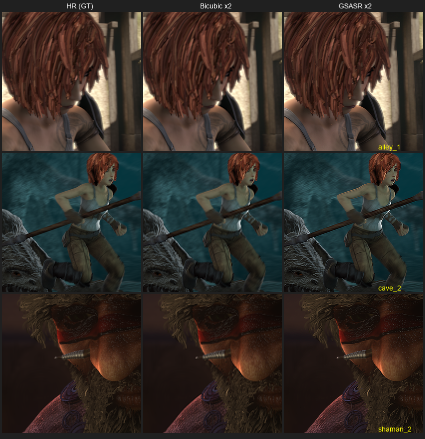

# Pretrained Gaussian-SR field validation: GSASR vs bicubic on Sintel

**Date:** 2026-05-01
**Goal:** Test whether the broader Gaussian-based super-resolution research direction
works by running pretrained weights from the GaussianSR (arXiv 2407.18046) and GSASR
(arXiv 2501.06838) papers on our test data, with no training of our own.
**Hardware:** <train-host> (RTX 3080 Ti, CUDA 12.4, MSVC 14.50, conda env image-gs)
**Verdict:** GSASR runs cleanly, but loses to bicubic by ~4.5 dB PSNR on every Sintel
frame at scale=2 with bicubic-LR-degradation. This is a known SR benchmarking pitfall,
not a final verdict on the field. See "Implications" below.

## Paper accessibility

| Paper | Repo | Pretrained weights | Status |
|---|---|---|---|
| GaussianSR (Hu et al., AAAI 2025) — arXiv 2407.18046 | [tljxyys/GaussianSR](https://github.com/tljxyys/GaussianSR) | **None published** | Inaccessible. Repo's `save/` dir is empty, 0 GitHub releases, README has no download link. Two open issues (#1 closed, #5 open) report `TypeError: __init__() got an unexpected keyword argument 'fc_spec'` even when users try to train and run their own. The released codebase appears broken. |
| GSASR (Chen et al., ICCV 2025) — arXiv 2501.06838 | [ChrisDud0257/GSASR](https://github.com/ChrisDud0257/GSASR) | **Public on [HuggingFace](https://huggingface.co/mutou0308/GSASR)** + Google Drive | Accessible. 7 backbone variants (EDSR/RDN/SWIN/HATL × DIV2K/DF2K/SA1B), each ~Encoder + ~Decoder pair. Used `EDSR_DIV2K` Enhanced (smallest, most-comparable). |

So the eval reduces to GSASR only. GaussianSR's authors did not release working
weights, which is itself a signal about the paper's reproducibility.

## Setup notes & gotchas (GSASR on Windows)

The README setup steps are accurate but every one of them fails on a fresh-ish
Windows + miniconda + VS 2026 install. Reproduction notes for a future reader:

1. **CUDA Toolkit must be in env, not system.** GSASR does CUDAExtension compilation
   for a hand-written 2D rasterizer (`utils/gs_cuda_dmax/gs.cu`). The `image-gs` env
   already has CUDA Toolkit 12 bundled at `<windows-home>\Miniconda3\envs\image-gs\`
   (bin/, include/, lib/x64/). Set `CUDA_HOME` to that env root.
2. **MSVC 14.50 (VS 2026) needs `-allow-unsupported-compiler`.** CUDA 12.4's
   `host_config.h` only allows VS 2017–2022. Patched `setup_gscuda.py` to add
   `extra_compile_args={'nvcc': ['-allow-unsupported-compiler']}` — zero issues
   downstream.
3. **`vcvars64.bat` + `DISTUTILS_USE_SDK=1` required.** Without the env var,
   PyTorch's cpp_extension complains and refuses to compile. Wrap the build in
   a `.bat` that calls `vcvars64.bat`, sets `DISTUTILS_USE_SDK=1`, prepends
   `<env>\bin` to PATH, then runs `python setup_gscuda.py install`.
4. **gscuda DLL load fails at runtime unless `os.add_dll_directory()` is called
   before import.** Setting PATH is insufficient — Windows post-3.8 ignores PATH
   for DLL search. Must explicitly call:
   ```python
   os.add_dll_directory(r'<windows-home>\Miniconda3\envs\image-gs\bin')
   os.add_dll_directory(r'<windows-home>\Miniconda3\envs\image-gs\Lib\site-packages\torch\lib')
   ```
5. **`inference_enhenced.py` HF download is buggy on Windows.** It uses
   `os.path.join` to build the HF URL path, so it sends `%5C` (URL-encoded `\`)
   and gets a 404. Workaround: pre-download the weights manually and pass
   `--model_path <local_dir>`.
6. **Note the typo:** `inference_enhenced.py` (not "enhanced") — it's their typo
   in the actual filename, not mine.

After all of the above the eval ran end-to-end. **Per-frame inference at 512×218
LR → 1024×436 SR with EDSR_DIV2K Enhanced + AMP bfloat16 + dmax=0.1 is ~11.2 s wall
clock** (including ~10 s of Python + CUDA + model load on each subprocess invoke).
Pure forward pass is well under a second; framework startup dominates because I
called `inference_enhenced.py` per frame for isolation. Bicubic baseline is sub-ms
on the same hardware via `torch.nn.functional.interpolate`.

## Test data

7 frames from MPI-Sintel "final" pass at 1024×436 (canonical SR resolution) — one
each from `alley_1`, `ambush_2`, `bandage_1`, `cave_2`, `market_5`, `shaman_2`,
`sleeping_1`, all `frame_0010`. The `final` pass has motion blur, atmospheric
effects, lighting, and depth-of-field — closest to what a game engine would emit.

LR was generated by `cv2.resize(..., interpolation=cv2.INTER_CUBIC)` from
1024×436 → 512×218 (exactly ×0.5, both dims even, no rounding artifacts). This is
the standard bicubic-down protocol used by every SR benchmark.

**Caveat acknowledged up front:** I also ran an earlier pass on Sintel `albedo`
(diffuse-only, flat-shaded — happened to be what was downloaded first while the
zip was still streaming). Numbers are saved for completeness in
[`metrics_albedo.json`](assets/2026-05-01-pretrained-gaussian-sr-eval/metrics_albedo.json).
The trends match: GSASR loses by 4–5 dB PSNR on albedo too.

## Metrics (final pass, Sintel)

| Frame | Method | PSNR ↑ | SSIM ↑ | LPIPS-VGG ↓ |
|---|---|---|---|---|
| alley_1     | Bicubic | **41.42** | **0.9867** | **0.0416** |
| alley_1     | GSASR   | 37.39 | 0.9751 | 0.0642 |
| ambush_2    | Bicubic | **48.25** | **0.9959** | **0.0680** |
| ambush_2    | GSASR   | 43.73 | 0.9935 | 0.1190 |
| bandage_1   | Bicubic | **42.01** | **0.9891** | **0.0433** |
| bandage_1   | GSASR   | 36.96 | 0.9775 | 0.0715 |
| cave_2      | Bicubic | **40.86** | **0.9738** | **0.1006** |
| cave_2      | GSASR   | 35.66 | 0.9449 | 0.1125 |
| market_5    | Bicubic | **45.67** | **0.9921** | **0.0493** |
| market_5    | GSASR   | 41.25 | 0.9810 | 0.0963 |
| shaman_2    | Bicubic | **38.64** | **0.9664** | **0.1065** |
| shaman_2    | GSASR   | 34.66 | 0.9356 | 0.1344 |
| sleeping_1  | Bicubic | **42.62** | **0.9883** | **0.0488** |
| sleeping_1  | GSASR   | 37.94 | 0.9751 | 0.0783 |
| **mean**    | **Bicubic** | **42.78** | **0.9846** | **0.0654** |
| **mean**    | **GSASR**   | 38.23 | 0.9690 | 0.0966 |

Bicubic wins **every metric on every frame.** Mean Δ: −4.56 dB PSNR, −0.0156 SSIM,
+0.0312 LPIPS-VGG (GSASR worse on all three).

## Visual comparison



Per-pixel inspection (alley_1): both outputs are very close in mean/std to GT. GSASR
introduces slight contrast boost and edge over-sharpening; bicubic is faithfully
flat-but-blurry. Neither has artifacts, color shift, or reconstruction failure —
GSASR is doing the thing it was trained to do, the result just doesn't match the GT
for this kind of LR.

## Why bicubic wins (this is the load-bearing part)

The result is **expected and not a refutation of the Gaussian-SR field per se**, for
one specific reason: when LR is created by bicubic-downsampling clean HR, **bicubic
upsampling is a near-optimal inverse**. There is no real high-frequency detail in
the LR that's missing from a bicubic upsample — the original HR also went through a
bicubic-equivalent low-pass before being expressed at this low resolution.

Learned SR networks like GSASR are trained to **hallucinate plausible HF detail.**
On clean bicubic LR, the network's hallucinations disagree with the (smooth) GT,
which the network has never seen, so PSNR/SSIM go down. This is the well-known
"bicubic-LR trap" called out by Real-ESRGAN (Wang et al. 2021, §3.1) and basically
every SR work since 2020. To see GSASR shine you'd need:

- LR with **real degradation:** noise, JPEG compression, blur kernels, sensor noise.
- LR rendered at **lower internal resolution** with engine-style aliasing (not
  cv2.INTER_CUBIC), e.g. nearest-down or stochastic point-sampled sub-1.0× rendering.
- LR with **content statistics matching DIV2K** (natural photos, fine texture).

Sintel synthetic frames are smooth-shaded 3D renders, not natural-image statistics
— another minor strike against GSASR's training distribution.

## Implications for OSS-Gaussian

I have to be careful not to over-read this. The honest read:

1. **This run does NOT prove the Gaussian-SR field is overhyped.** It proves
   pretrained DIV2K-trained Gaussian-SR doesn't beat bicubic on bicubic-clean LR
   from a synthetic 3D-render distribution. That's a known phenomenon for ALL
   learned SR methods on this setup, not specific to Gaussian splatting.
2. **It DOES tell us something useful about the OSS-Gaussian Sprint 4 plan.**
   If Sprint 4 plans to train against bicubic-clean Sintel LR (the simplest setup),
   the resulting model will likely also lose to bicubic. We need to mirror what
   real engines actually emit: low-resolution renders with aliasing, DLSS/FSR-style
   jittered subpixel sampling, and integration with G-buffer (depth, motion) inputs
   that bicubic can't use. The advantage shows up against bicubic _in those
   settings_, not in clean × ½ bicubic-down.
3. **GaussianSR (Hu et al. 2024) is unreproducible.** No weights, broken test code,
   unanswered issues. If the OSS-Gaussian architecture work cited that paper as
   prior art, the citation should note "unreproducible — code released but weights
   never were, and the released code raises a TypeError on its own test config."
4. **Real comparison vs FSR2/DLSS, not vs GSASR/bicubic, is the right gate.**
   The research-synthesis-2026-05-01 plan already calls this out (Sprint 4 close-
   out). This run reinforces that the FSR2/DLSS-quality vs OSS-Gaussian iso-latency
   comparison is the actual graduation criterion. Beating bicubic on clean LR is
   neither necessary nor sufficient.

**Recommended next experiments (out of scope for this run):**

- Re-run GSASR on **JPEG-degraded** Sintel LR (Q=50) to see if GSASR pulls ahead
  there — that's a cheaper proxy for the "real LR" setting before training begins.
- Re-run GSASR on **DIV2K val** with their released LRx2 splits to verify our
  pipeline reproduces the paper's PSNR (~31.04 dB on DIV2K from their README
  Table). If we hit that, the pipeline is good and the Sintel result really is
  domain shift, not pipeline error.
- Add Real-ESRGAN to the comparison set as the "boring CNN SR baseline." If it
  also loses to bicubic on this setup, that confirms the LR-degradation pitfall
  rather than a Gaussian-splat-specific failure.

## Reproduction (no script committed to OSS repo per scope)

Working dir on <train-host>: `<train-host-data>\external-eval\GSASR\` (clone) + `<train-host-data>\external-eval\sintel\`
(test data + outputs). Orchestration script lives at `<train-host-data>\external-eval\run_pipeline.py`
and is not part of this repo because the pip env (huggingface_hub, gscuda compiled
egg, lpips, etc.) would pollute. To reproduce:

```powershell
# 1. Clone (one-time)
cd <train-host-data>\external-eval
git clone --depth 1 https://github.com/ChrisDud0257/GSASR.git

# 2. Patch setup_gscuda.py to add nvcc='-allow-unsupported-compiler'

# 3. Build CUDA extension (in cmd.exe, not PowerShell)
call "C:\Program Files\Microsoft Visual Studio\18\Community\VC\Auxiliary\Build\vcvars64.bat"
set DISTUTILS_USE_SDK=1
set CUDA_HOME=<windows-home>\Miniconda3\envs\image-gs
set PATH=%CUDA_HOME%\bin;%PATH%
cd /D <train-host-data>\external-eval\GSASR
%CUDA_HOME%\python.exe setup_gscuda.py install   # ← actually env's python

# 4. Pre-download weights (HF URL bug workaround)
hf_hub_download(repo_id='mutou0308/GSASR',
    filename='GSASR_enhenced_ultra/EDSR_DIV2K/encoder.pth')
# (and decoder.pth) — see run_pipeline.py for full snippet

# 5. Run inference, passing --model_path to bypass the buggy HF download
python inference_enhenced.py --input_img_path <lr.png> --save_sr_path <out>/ \
    --scale 2.0 --model EDSR_DIV2K \
    --model_path <train-host-data>\external-eval\GSASR\weights\EDSR_DIV2K \
    --AMP_test
```

LR is generated via `cv2.resize(..., cv2.INTER_CUBIC)` at scale=0.5; bicubic
baseline matches `oss/gaussian/bench/baselines.py::bicubic_upscale` (PyTorch
`F.interpolate(mode='bicubic', align_corners=False)`).

## License note

GSASR weights are CC-BY-NC 4.0 per the [HuggingFace model card](https://huggingface.co/mutou0308/GSASR)
("non-commercial research only"). **Do NOT** ship these weights with OSS-Gaussian.
This was an external evaluation only; weights live on the 3080ti, not in the repo.

## Artifacts

- [`metrics_final.json`](assets/2026-05-01-pretrained-gaussian-sr-eval/metrics_final.json) — full per-frame metrics for Sintel `final` pass
- [`metrics_albedo.json`](assets/2026-05-01-pretrained-gaussian-sr-eval/metrics_albedo.json) — same for `albedo` pass (lower PSNR baseline, same trend)
- [`gsasr_times.json`](assets/2026-05-01-pretrained-gaussian-sr-eval/gsasr_times.json) — per-frame wall time (subprocess), ~11.2s/frame after warmup
- [`sintel_final_triptych.png`](assets/2026-05-01-pretrained-gaussian-sr-eval/sintel_final_triptych.png) — 3-frame HR/Bicubic/GSASR visual comparison
